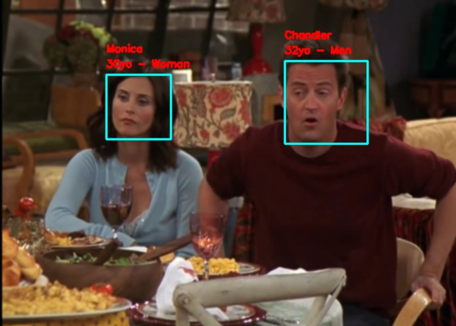
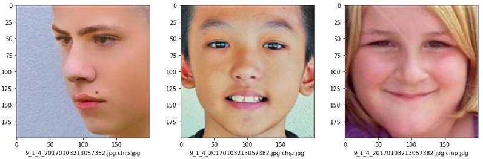
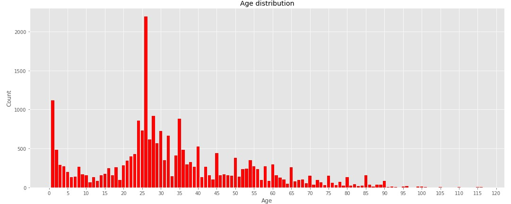
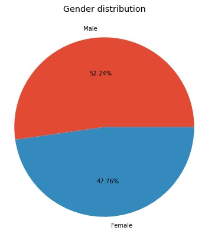
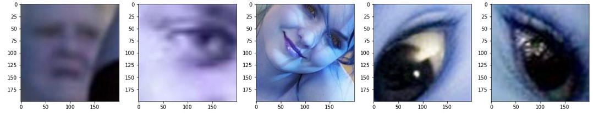
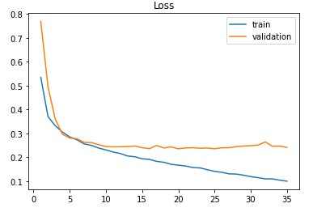
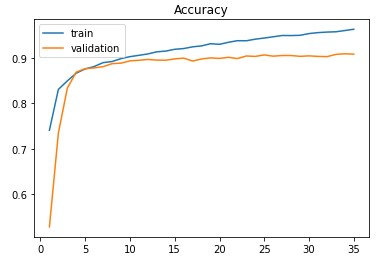
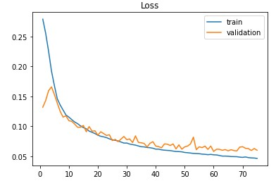

# Facetection
Face detection, age, name & gender recognition from streaming, videos, photos...

## Getting started

### Introduction

This is a Computer Vision project based on Deep Learning models to predict carateristics from person's face. Faces can be detected through several media : 
* Video
* Webcam
* Digital images




### Dependencies

Python 3.8

* Tensorflow
* Numpy
* OpenCV 4.+
* face-recognition (for face embeddings)

## Workflow

### Data

#### Collecting datasets

Models are have been trained on the UTKFace dataset. It provides a large-scale face dataset with long age span (range from 0 to 116 years old). The dataset consists of over 20,000 face images with annotations of age, gender, and ethnicity. The images cover large variation in pose, facial expression, illumination, occlusion, resolution, etc. 

[Link] https://susanqq.github.io/UTKFace/



In order to train the name recognizer, images can be collected through webcam and videos. A new folder is created with the specified name. 

```
datasets/
---- name001
        001.jpg
        002.jpg
        ...
        n.jpg
---- name002
        001.jpg
        002.jpg
        ...
        n.jpg
  ...
```

#### Analysis

More information in ```ÈDA.ipynb```

* **Labels repartition**

   

* **Outliers**

Considering outliers as images where we cannot distinguish faces's ROI, 37 files have been detected. Here is a sample :



### Preprocessing

Images have been scaled down to 128x128 so that it is less memory-consuming. RGB channels have been kept. Pixels values have been divided by 255.

### Gender recognition

Train on 70% of the UTKFace dataset (30% reserved for validation), the model reached a 90% accuracy on the validation set and test set.
The model is a DCNN and outputs a score indicating a probability/confidence on both gender. The final activation function is a *softmax* function. 

```
loss : categorical_crossentropy
batch_size : 128
epochs : 35
learning rate : 1e-4
```

 

### Age recognition

In the same proportion as before, the model reached a MAE of 0.05 on validation set. Note that ages have been divided by 116 which is the maximum age in the dataset for normalization.

```
loss : mean absolute error (since ages have been normalized)
batch_size : 256
epochs : 75
learning rate : 1e-4
```




## Acknowledgement

* https://www.kaggle.com/werty12121/utkface-age-and-sex-prediction
* https://github.com/rodrigobressan/keras-multi-output-model-utk-face


